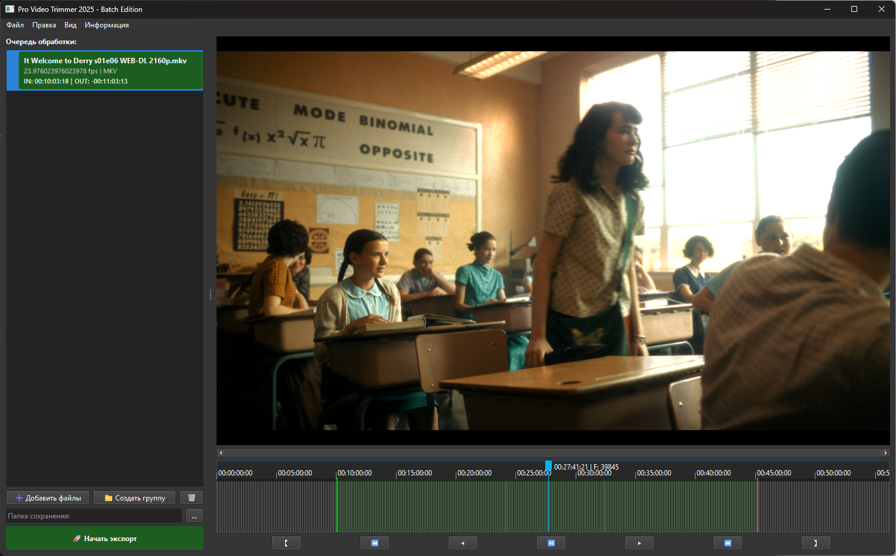

# ClipFlow

**ClipFlow** is a powerful desktop application for efficient video trimming and batch processing, built with Python, PyQt6, and libmpv. It simplifies the workflow of selecting segments from multiple videos, managing groups of clips, and exporting them with precision.



## Features

- **Batch Processing**: Organize videos into groups and apply edits across multiple files.
- **Precise Trimming**: Frame-accurate seeking and marker placement using the `libmpv` backend.
- **User-Friendly Interface**: Clean PyQt6-based UI with dark/light theme support.
- **Queue Management**: Efficiently manage an export queue for processing multiple jobs.
- **Keyframe Snapping**: Smart snapping to keyframes for lossless cutting (depending on export settings).

## Installation

### Prerequisites

- Windows 10/11
- Python 3.12+ (if running from source)
- `libmpv` (included in the distribution or available separately)
- `ffmpeg` (must be accessible in the system PATH or configured)

### Setup

1.  Clone the repository:
    ```bash
    git clone https://github.com/your-username/ClipFlow.git
    cd ClipFlow
    ```

2.  Install dependencies:
    ```bash
    pip install -r requirements.txt
    ```

3.  Ensure `ffmpeg` is installed and added to your system PATH.

## Usage

1.  Run the application:
    ```bash
    python main.py
    ```
    *(Or use `run.bat` if available)*

2.  Drag and drop video files into the application window.
3.  Use the timeline controls to set Start (Mark In) and End (Mark Out) points.
4.  Group videos if needed for bulk organization.
5.  Add items to the queue and click **Export**.

## Development

- **UI Framework**: PyQt6
- **Video Player**: `python-mpv` (libmpv wrapper)
- **Core Logic**: `core/` directory contains export processing and data models.
- **Utilities**: `utils/` contains settings and theme management.

## License

[MIT License](LICENSE)
